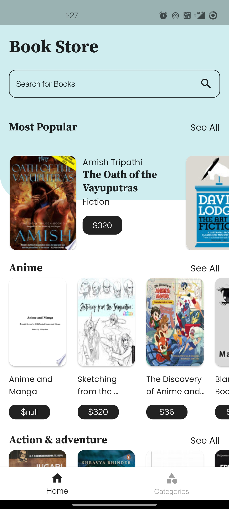
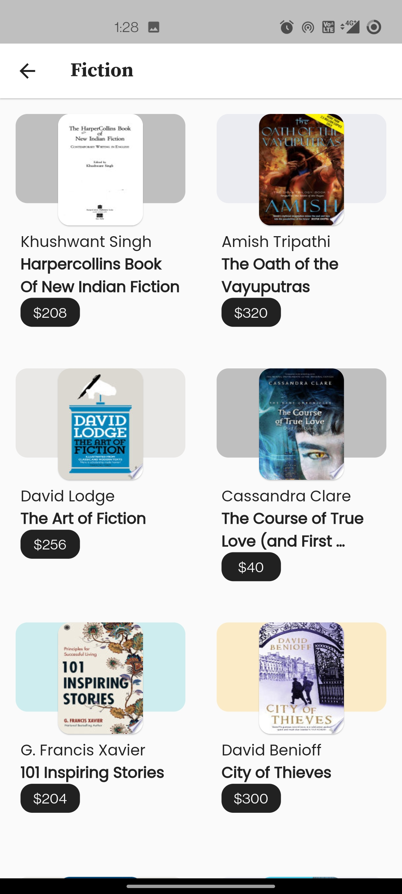
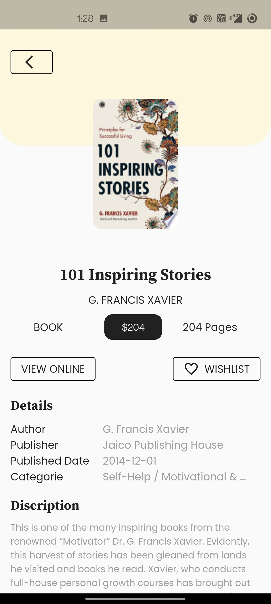
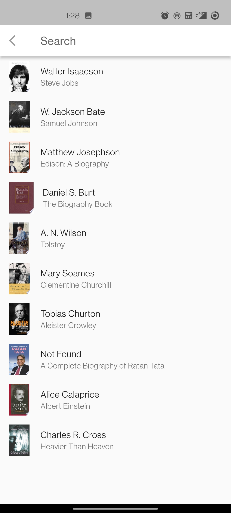
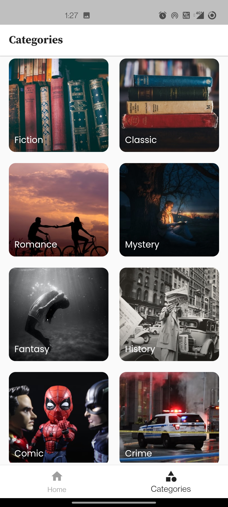

# Books App
 
Book App made in Flutter using Google Books Api. Search your Favourite books here or buy them. 

Google Api Documentations. [Click Here](https://developers.google.com/books/docs/v1/using)

## Libraries & Tools Used.
- [provider](https://pub.dev/packages/provider/install): Version-6.0.3
- [google_fonts](https://pub.dev/packages/google_fonts): Version-3.0.1
- [http](https://pub.dev/packages/http): Version-0.13.4
- [url_launcher](https://pub.dev/packages/url_launcher): Version-6.1.5
- [readmore](https://pub.dev/packages/readmore): Version-2.2.0

### App Screenshots
   
  
